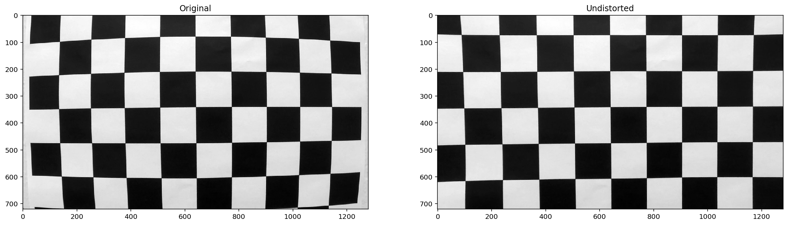
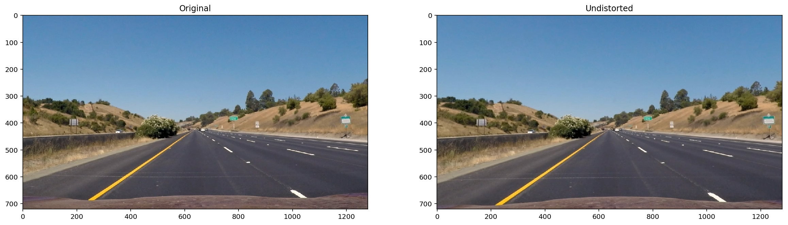
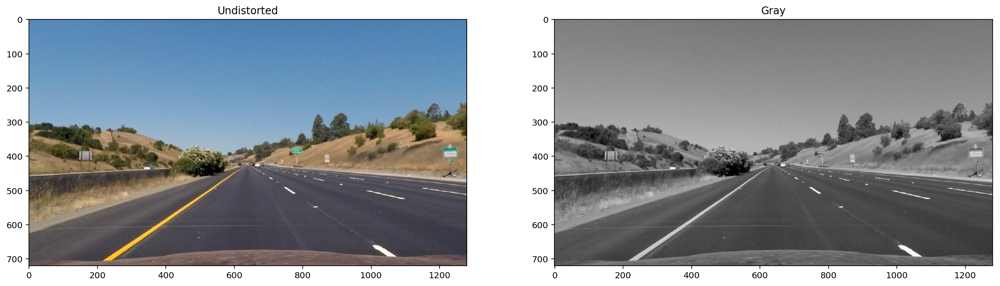
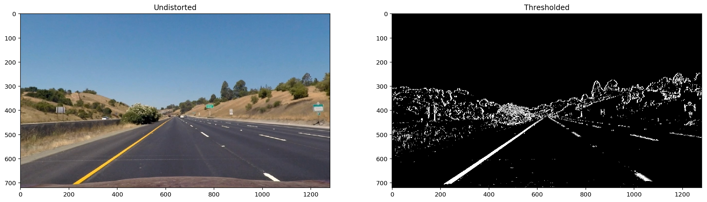
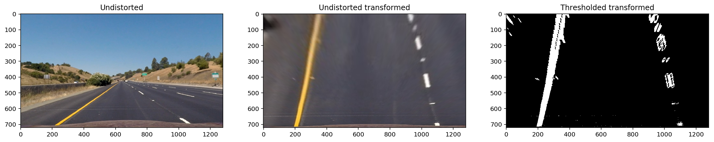
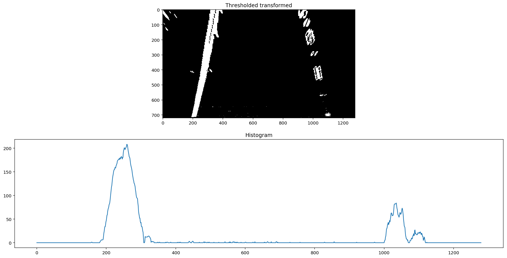
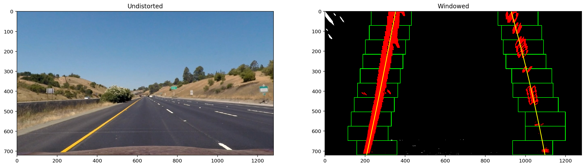
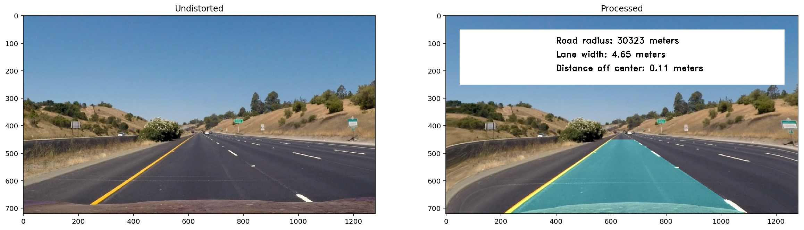

#  Project: Advanced lane finding

In this project, we are challenged to improve on the first lane finding project.
We are given images and video's, taken from a camera in the center of a car. From this data, we are asked to detect the lane line we are in.

The code I implemented can be found here:

https://github.com/kkalera/CarND-Advanced-Lane-Lines/blob/master/Advanced_lane_finding.ipynb

This code works good on the project video, but fails on the challenge video's. I'm going to try and implement a few different approaches to solving this at a later time.

## The steps I took:

 - Camera calibration

 - Calibrating the images

 - Using different color chanels, sobel and gradients to get a binary image.

 - Transform the image into a top-down or birds-eye view image.

 - Calculate which of the pixels make up the lane line

 - Calculate the radius of the lane line in meters

 - Calculate the vehicle's position on the lane line

 - Draw the polygon that make's up the lane on the image

 - Transform the image back to the original view

 - Overlay the information on the image.

   ​

 ### Camera Calibration:

#### 1. Briefly state how you computed the camera matrix and distortion coefficients. Provide an example of a distortion corrected calibration image.

I started off by loading the calibration images into memory. In this case we had 20 images of a checkered board with 9x6 squares.

I then created a function that takes in an array of calibration images, the shape of the checkered board and two booleans. One for returning the rotation vector and one for returning the translation vector.

The function takes the following steps:

- Prepare an array for the object points and define these points using np.mgrid function
- For each image, find the corners of the chessboard using opencv's "findChessboardCorners" function.
- With the corners found, use opencv's "calibrateCamera" function to get the camera matrix, distortion matrix, rotation vectors and translation vectors

This is a result of that function:

### Pipeline (single images)

#### 1. Provide an example of a distortion-corrected image.

To demonstrate this step, I will describe how I apply the distortion correction to one of the test images like this one:

#### 2. Describe how (and identify where in your code) you used color transforms, gradients or other methods to create a thresholded binary image. Provide an example of a binary image result.

The first step was converting all the images to grayscale. (Code found in the notebook at 2.3: Convert to grayscale).

This produces the following result:

After that, I applied Sobel and gradients to the image and used those to apply thresholding to get a binary image. (Code found in the notebook at 2.4: Thresholding)

This function produces the following result:

#### 3. Describe how (and identify where in your code) you performed a perspective transform and provide an example of a transformed image.

The next step was transforming the image to a birds eye view.  (Code found in the notebook at 3.2: Transform to birds eye view)

This produces the following result:

#### 4. Describe how (and identify where in your code) you identified lane-line pixels and fit their positions with a polynomial?

The first step in identifying the lane lines is getting a histogram on our thresholded image. (Code found in the notebook at 4.1: Histogram)

This was done in the function get_histograms and the output looks like this:

The next step was using a sliding window technique to identify the lane pixels. (Code found in the notebook at 4.2: Sliding window)

The function "slide_window" takes in a binary image, a window width, the minimum pixel count in order to recenter and optionally a histogram. 

By setting a window height , we calculate how much windows we will need and start at the peaks of the histogram. We then slide this window across the image (bottom to top) and recenter if needed. 

We end up with an array of left and right lane points. With these points we can use numpy's polyfit function to get a polynomial for our points. 

Finally the function returns an image that has the pixels of the lane in red, the windows used for the search in green and the polynomial in yellow, together with the left and right polynomials.

The output image looks like this:

#### 5. Describe how (and identify where in your code) you calculated the radius of curvature of the lane and the position of the vehicle with respect to center.

The curvature of the lane was calculated in the function get_curvature. (Code found in the notebook at 5: Calculate curvature)

#### 6. Provide an example image of your result plotted back down onto the road such that the lane area is identified clearly.

To process the images and video, I created a class named "lane_finder" this class contains all the functions needed to process images aswell as video. 

- The function "process_single_image" puts together all functions used above.
- The function "process_video_frames" uses "process_single_image" for the first image, but uses the previous polynomials for the frames after that.
- The function "process_video" loads the video file, run's the processing functions and saves the video as the provided path.

The output looks like this:

### Pipeline (video)

#### 1. Provide a link to your final video output. Your pipeline should perform reasonably well on the entire project video (wobbly lines are ok but no catastrophic failures that would cause the car to drive off the road!).

You can view the video here: https://www.youtube.com/watch?v=kMXlR7UxIUE

### Discussion

#### 1. Briefly discuss any problems / issues you faced in your implementation of this project. Where will your pipeline likely fail? What could you do to make it more robust?

The project video works great! But my pipeline starts to fail in the challenge video's. A possible sollution might be to not only filter on white and yellow lines, but also on black lines. Maybe with some sort of contrast filtering. I also had the idea of using this pipeline to train a cnn to do this. I think this would be a much more robust way of detecting the lanes. This could also possibly increase the distance at which we can detect the lanes.